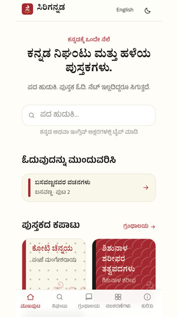
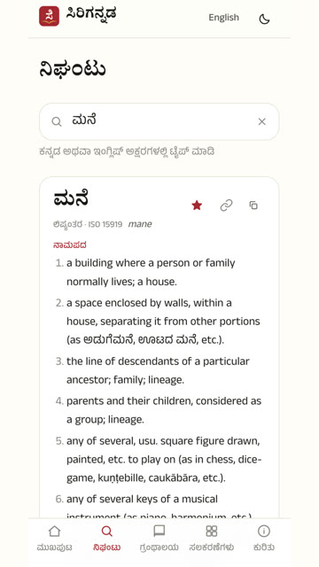
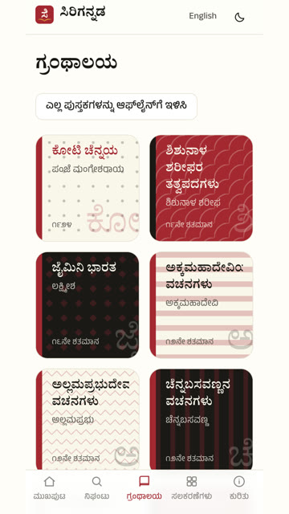

# ಸಿರಿಗನ್ನಡ · Sirigannada

**ಪದದಿಂದ ಪರಂಪರೆಯವರೆಗೆ.**

ಹುಡುಕಿ. ಓದಿ. ಕಲಿಯಿರಿ. ಕನ್ನಡವನ್ನು ಹೊಸದಾಗಿ ಅನ್ವೇಷಿಸಿ.

**ತಾಣ:** [sirigannada.in](https://sirigannada.in)

**From words to heritage.** Search, read, learn, and discover Kannada anew. No account. No ads.

## ಹೇಗೆ ಬಳಸುವುದು · How to use

Open [sirigannada.in](https://sirigannada.in) on a phone or computer. Kannada is the default; tap **English** in the header to switch.

[೨೦ ಸೆಕೆಂಡ್ ವೀಡಿಯೊ](https://sirigannada.in/demo.mp4) · home, dictionary, library, Nudi, alphabet.

<video controls playsinline muted width="280" poster="public/screenshots/howto-home.jpg">
  <source src="https://sirigannada.in/demo.mp4" type="video/mp4" />
</video>

<p>
  
  
  
</p>

### ನಿಘಂಟು · Dictionary

1. Tap **ನಿಘಂಟು**, or type in the search box on the home page.
2. Search in Kannada (`ಮನೆ`), English (`house`), or Latin letters (`mane`).
3. If nothing matches, tap a suggestion under **ಇದನ್ನೇ ಹುಡುಕುತ್ತಿದ್ದೀರಾ?**.
4. Tap the star (**ಇಷ್ಟಪಟ್ಟಿಗೆ ಸೇರಿಸಿ**) to save a word. Recent searches stay on the empty screen.
5. Share a word with **ಕೊಂಡಿ ನಕಲಿಸಿ**. The address looks like `/dictionary?w=ಮನೆ`.

The dictionary is [Alar](https://alar.ink) by V. Krishna (ODbL 1.0).

### ಗ್ರಂಥಾಲಯ · Library

1. Tap **ಗ್ರಂಥಾಲಯ**. The first books are ಕೋಟಿ ಚೆನ್ನಯ, ಶಿಶುನಾಳ ಶರೀಫ, then ಜೈಮಿನಿ ಭಾರತ.
2. Open a book. Use the buttons to turn pages. Tap a word to look it up.
3. Long-press a verse to copy its link.
4. On the library page, tap **ಎಲ್ಲ ಪುಸ್ತಕಗಳನ್ನು ಆಫ್‌ಲೈನ್‌ಗೆ ಇಳಿಸಿ** to keep every book on the device.

Every book lists its author, death year, source, and licence on [ಮೂಲಗಳು](https://sirigannada.in/credits). Only public-domain texts (author died in or before 1965) or permitted Creative Commons works.

### ಸಲಕರಣೆಗಳು · Tools

From **ಸಲಕರಣೆಗಳು**:

| Tool | What it does |
|---|---|
| [ಲಿಪ್ಯಂತರ](https://sirigannada.in/tools/transliterate) | Kannada ↔ ISO 15919 Latin. Needs the dots: `kannaḍa` → ಕನ್ನಡ, not plain `kannada`. |
| [ಅಂಕೆಗಳು](https://sirigannada.in/tools/numbers) | Arabic ↔ Kannada digits, and numbers in words. |
| [ನುಡಿ / ಬರಹ](https://sirigannada.in/tools/convert) | Paste Nudi/Baraha ASCII (`PÀ£ÀßqÀ`) to get Unicode ಕನ್ನಡ. Wrap English in `$...$`. |
| [ವರ್ಣಮಾಲೆ](https://sirigannada.in/learn/alphabet) | Vowels, consonants, ಕಾಗುಣಿತ, ಒತ್ತಕ್ಷರ. Tap a letter to hear it if the phone has a Kannada voice. |
| [ಗಾದೆಗಳು](https://sirigannada.in/proverbs) | Search 2,000+ folk sayings (CC BY-SA, Kannada Wikiquote). |

### ಆ್ಯಪ್ ಮತ್ತು ಆಫ್‌ಲೈನ್ · Install and offline

On Android Chrome: menu → **Add to Home screen** (or tap **ಆ್ಯಪ್ ಆಗಿ ಸೇರಿಸಿ** on the home page). On iPhone: Share → **Add to Home Screen**.

After it is installed, turn the network off and try ನಿಘಂಟು plus one book. The first dictionary search needs the network once so that shard can cache.

## What is in the app

| | | |
|---|---|---|
| ನಿಘಂಟು | Dictionary | ~1.5 lakh Alar entries |
| ಗ್ರಂಥಾಲಯ | Library | 12 public-domain books, page-turn reader |
| ಸಲಕರಣೆ | Tools | Transliteration, numbers, Nudi, alphabet, proverbs |

Code is AGPL-3.0. Original writing is CC BY-SA 4.0. If this site stops, anyone can run it again from the source.

## Contributing

Pull requests are welcome. Work on a **feature branch**, verify it, then open a PR into `main`. Never push to `main`. Every commit needs `git commit -s` (DCO). There is no CLA.

1. Read [CONTRIBUTING.md](CONTRIBUTING.md).
2. Open an issue first for a new book (use the template; death year must be 1965 or earlier for public-domain claims).
3. Fork, one change per PR, `git commit -s`.

Do not copy code or curated data from other Kannada projects.

## Development

```bash
npm install
npm run data        # dictionary + books into public/data
npm run typecheck && npm test
npm run data:validate
npm run dev         # http://localhost:3000
```

Maintainers: `docs/handbook.md` (local) is the internal map.

## Data credits

- **Alar** Kannada–English dictionary © V. Krishna, [ODC-ODbL 1.0](https://opendatacommons.org/licenses/odbl/). [alar.ink](https://alar.ink)
- Books from [Kannada Wikisource](https://kn.wikisource.org). Per-book provenance is in each book file and on `/credits`.
- Proverbs from Kannada Wikiquote, CC BY-SA 4.0.

## License

Code: [AGPL-3.0-or-later](LICENSE). Original content and documentation: CC BY-SA 4.0. Third-party data keeps the licence in its `provenance` block.
